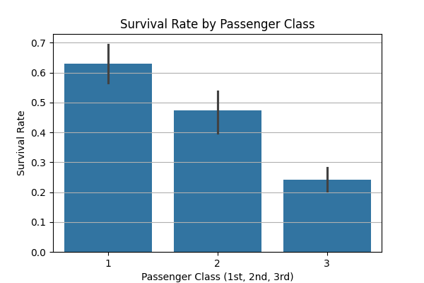
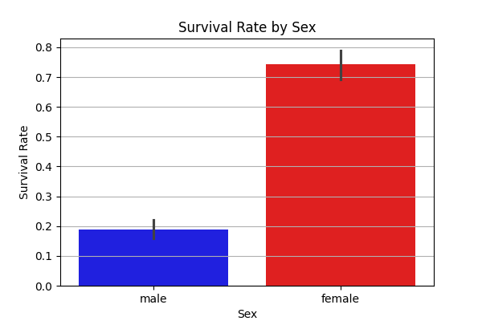
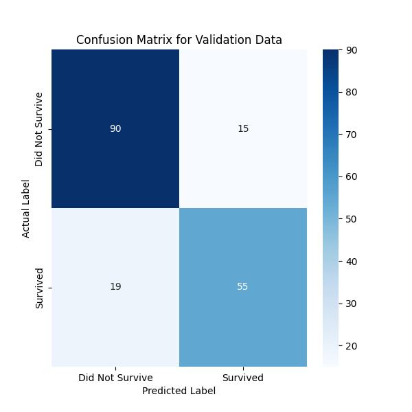

# 🚢 Task 1: Titanic Survival Prediction

## 🎯 Goal
The main objective was to build a machine learning model to predict the survival outcome (Survived or Not Survived) of passengers on the Titanic, based on features like Passenger Class, Sex, Age, and Fare.

## 🛠️ Method Used (The "How I Did It")

### 1. Data Preprocessing
* **Combined Data:** The training and test datasets were combined into one large DataFrame to ensure consistent data cleaning and feature creation across both sets.
* **Missing Values:** Missing values in the **Age** and **Fare** columns were filled using the average (mean) value. Missing values in **Embarked** (port of embarkation) were filled using the most common value (mode).
* **Feature Encoding:** The **Sex** column was converted into numbers (1 for male, 0 for female). The **Embarked** column was converted using one-hot encoding.
* **Scaling:** All numerical features were standardized using **StandardScaler** to ensure the Logistic Regression model worked optimally.

### 2. Model Training
* **Model:** A **Logistic Regression** classifier was chosen, as it is a strong baseline model for binary classification problems (Yes/No predictions).
* **Splitting:** The original training data was split 80/20 into training and validation sets for unbiased performance checking.

### 3. Key Data Insights (Visualizations)

The following charts were generated during the EDA phase, confirming the most important factors for survival:

#### Survival Rate by Passenger Class
Higher passenger class (1st Class) significantly increased the chance of survival.

#### Survival Rate by Sex
Women had a dramatically higher survival rate compared to men (S.O.S. protocol: "Women and children first").

## 📊 Final Evaluation

* **Validation Accuracy:** **81.01%**
    * This score means the model correctly predicted the fate of **81.01%** of the passengers in the unseen validation set.

### Confusion Matrix
The confusion matrix shows the details of the model's performance:

| | Predicted Not Survive | Predicted Survive |
| :--- | :--- | :--- |
| **Actual Not Survive** (True Negatives) | [Insert True Negative count] | [Insert False Positive count] |
| **Actual Survive** (False Negatives) | [Insert False Negative count] | [Insert True Positive count] |

(The exact numbers are visible in the attached `confusion_matrix.png` file.)

---
