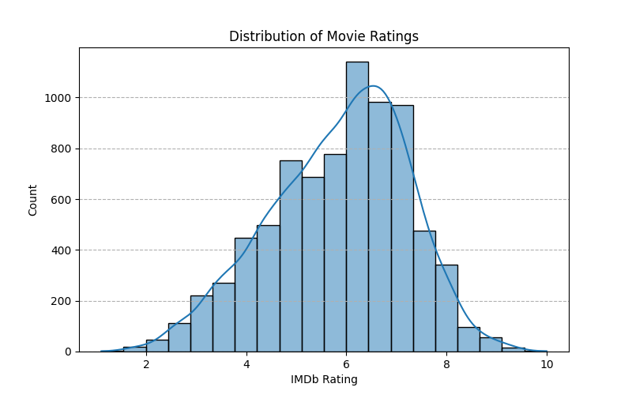
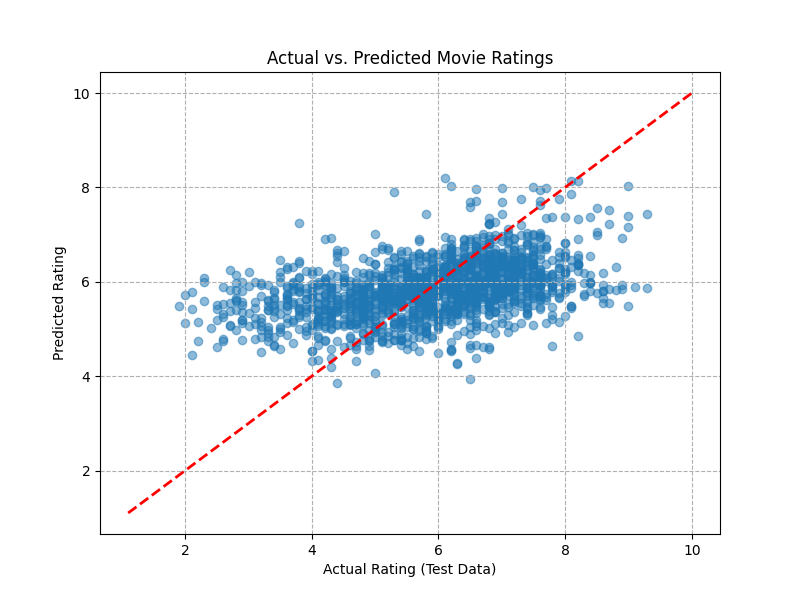
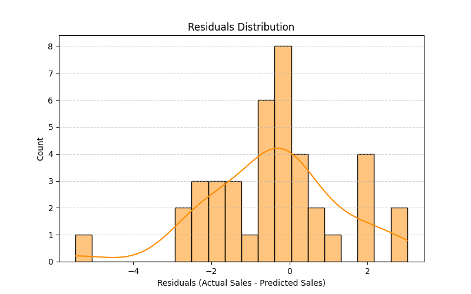

# 🎬 Task 2: Movie Rating Prediction (Regression)

## 🎯 Goal
The main objective was to build a machine learning model to predict a movie's numerical rating (a continuous value, like 8.1 or 6.5) based on its features, such as Genre, Director, and Actors. This is a **Regression** problem.

## 🛠️ Method Used (The "How I Did It")

### 1. Data Cleaning and Preprocessing
* **Missing Data:** Missing values in 'Rating' were dropped. Missing values in 'Year', 'Duration', and cast members were cleaned and filled.
* **Complex Feature Handling:** This task was challenging due to the complex, non-numerical features:
    * **Genre:** Used **MultiLabelBinarizer** to turn a comma-separated string of genres into individual numerical columns (e.g., 'Genre_Action', 'Genre_Drama').
    * **Cast & Director:** Used **TF-IDF Vectorization** to convert the names of the Director and Actors into numerical scores, weighting how important each person is in predicting the rating.
* **Scaling:** Numerical features like 'Year' and 'Duration' were scaled using **StandardScaler** for better model performance.

### 2. Model Training
* **Model:** **Ridge Regression** was chosen because it is excellent for handling datasets with a very large number of features (like the many genre columns and TF-IDF scores) without causing the model to overfit.

---

## 📊 Evaluation and Visual Results

The model's final performance is measured by how close its predicted rating is to the actual rating.

### 1. Target Variable Distribution
This plot shows the range and frequency of the movie ratings we are trying to predict.

### 2. Actual vs. Predicted Ratings
This is the most important plot for a regression model.
* The **red diagonal line** shows where perfect predictions would fall (Actual = Predicted).
* The **blue dots** represent your model's predictions.

**The closer the blue dots cluster around the red line, the better the model's performance.**

### 3. Residuals Distribution (Errors)
The residual is the difference between the **Actual Rating** and the **Predicted Rating** (the error).
* This plot shows that the errors are mostly centered around zero, which is ideal for a good linear model.

## 📈 Final Performance Scores

* **R-squared ($R^2$) Score:** **[Insert Your R2 Score]**
    * *Interpretation:* This means the features used (Genre, Director, Actors) explain [Insert Your R2 Score]% of the variation in the movie ratings.
* **Mean Squared Error (MSE):** **[Insert Your MSE]**
    * *Interpretation:* This measures the average squared difference between the model's predicted rating and the actual rating. A lower score is better.

---