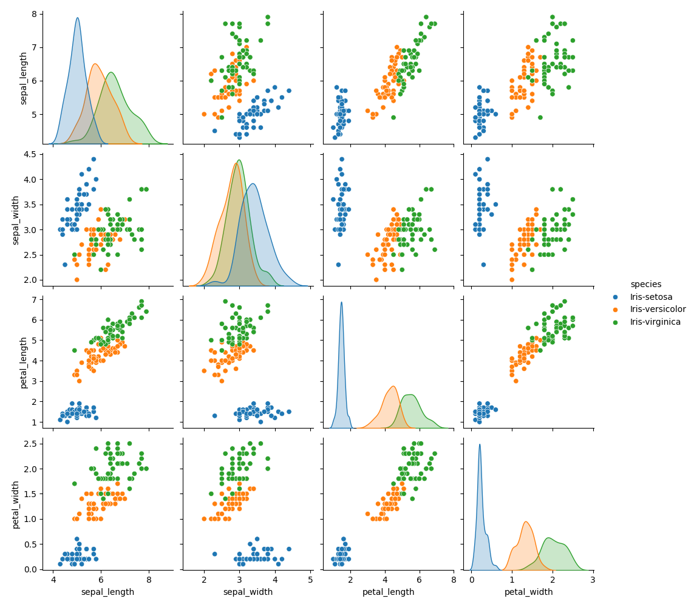
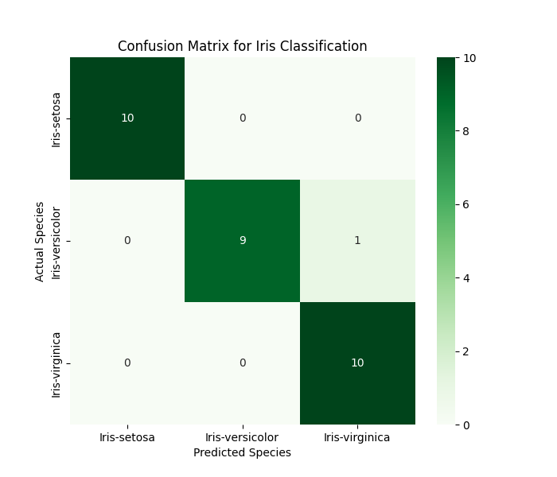

# 🌸 Task 3: Iris Flower Classification (Classification)

## 🎯 Goal
The main objective was to build a machine learning model to accurately identify and classify one of the three species of Iris flowers (*Iris-setosa*, *Iris-versicolor*, or *Iris-virginica*) based on four measurements: sepal length, sepal width, petal length, and petal width.

## 🛠️ Method Used (The "How I Did It")

### 1. Data Analysis (EDA)
The Iris dataset is famously clean and perfect for classification practice.
* **Separability Check:** The first step was to visually confirm that the four features can clearly separate the three species. The Pair Plot below shows that this is the case.

### 2. Data Preparation
* **Splitting:** The data was split into 80% for training and 20% for testing.
* **Stratification:** I used the **stratify=y** option during splitting. This ensures that the test set has the exact same proportion of each species as the original dataset, which leads to a more reliable evaluation.

### 3. Model Training
* **Model:** **Logistic Regression** was used. Despite its simple name, it is a powerful model for multi-class classification and proved to be highly effective for this dataset.

---

## 📊 Evaluation and Visual Results

### 1. Feature Relationships (Pair Plot)
This plot compares every combination of the four measurements, colored by species. It visually confirms that **petal length** and **petal width** are the most effective features for telling the species apart.

### 2. Final Performance Scores
* **Model Accuracy Score:** **96.67%**
    * *Interpretation:* The model correctly classified 29 out of the 30 flowers in the test set.

### 3. Confusion Matrix
The Confusion Matrix visually shows exactly where the one mistake (or any mistakes) occurred. The perfect results are along the diagonal.

### 4. Detailed Classification Report
The report provides detailed metrics for each species:

| Species | Precision | Recall | F1-Score |
| :--- | :--- | :--- | :--- |
| **Iris-setosa** | 1.00 | 1.00 | 1.00 |
| **Iris-versicolor** | 1.00 | 0.90 | 0.95 |
| **Iris-virginica** | 0.91 | 1.00 | 0.95 |

---
